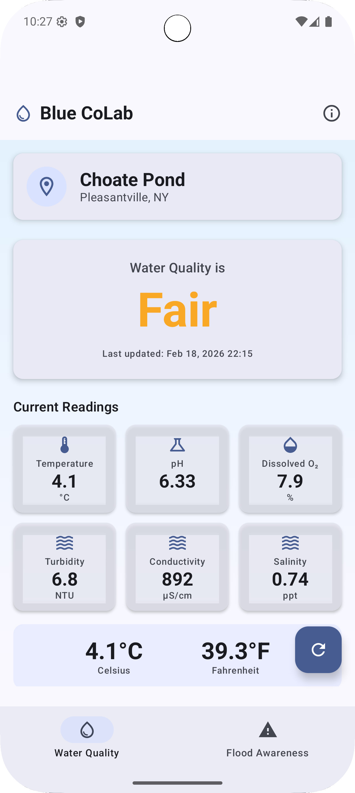
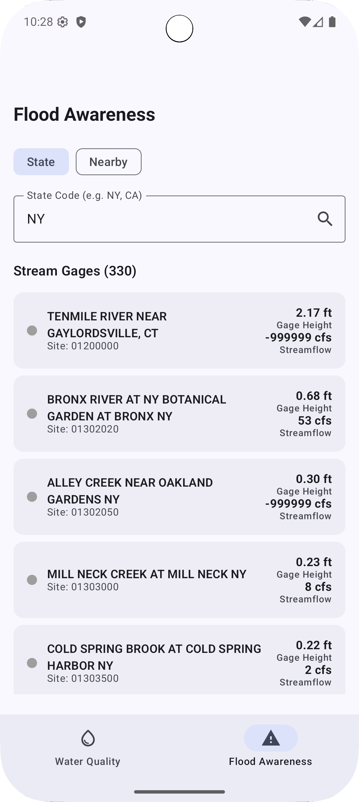
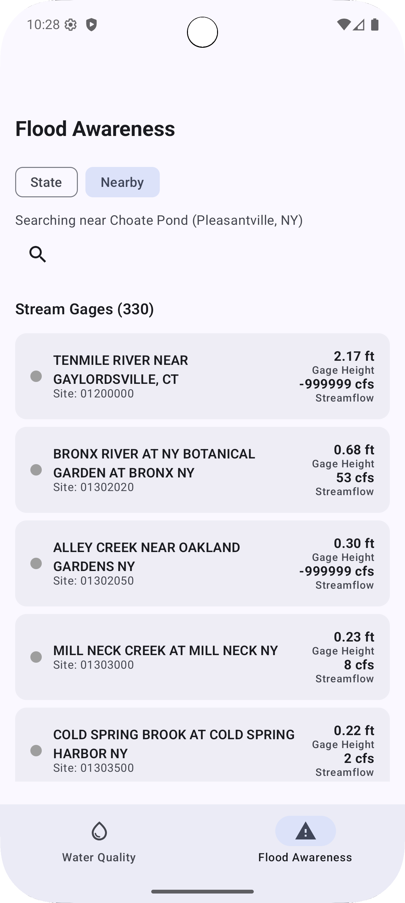

# BlueCoLab Water Monitor

<p align="center">
  
</p>

[](https://android.com)
[](https://kotlinlang.org/)
[](https://android-arsenal.com/api?level=26)
[](LICENSE)

> Real-time water level monitoring app for environmental awareness and flood safety.

---

## Overview

BlueCoLab Water Monitor is a native Android app that combines real-time water quality monitoring from the BCL sensor network with USGS flood awareness data. It provides live water quality readings from Choate Pond and integrates two public USGS APIs to display real-time gage height, streamflow, and flood impact status for nearby USGS streamgages.

**Key Purpose**: Enable communities to monitor local water quality and flood conditions for environmental awareness and public safety.

---

## Features

- **Real-Time Water Quality** - Live readings from the BCL sensor network (pH, temperature, dissolved oxygen, turbidity, conductivity, salinity)
- **Flood Awareness** - Real-time gage height and streamflow from USGS Instantaneous Values API, plus flood impact status from the USGS RTFI API
- **Color-Coded Flood Status** - Green (normal), yellow (elevated), red (flooding) indicators for each stream gage
- **Search by State or Location** - Find USGS stream gages by state code or proximity to coordinates
- **Bottom Navigation** - Switch between Water Quality and Flood Awareness screens
- **Material Design 3** - Modern, intuitive interface with light/dark theme support

---

## Screenshots

<p align="center">
  
  &nbsp;&nbsp;&nbsp;&nbsp;
  
  &nbsp;&nbsp;&nbsp;&nbsp;
  
</p>

---

## Download

### Option 1: Install APK (Recommended)
1. Download the latest APK from [Releases](https://github.com/salvatore-ardisi/bluecolab-water-monitor/releases)
2. Enable "Install from unknown sources" in Android settings
3. Install the APK
4. Grant necessary permissions when prompted

### Option 2: Build from Source
See [Building from Source](#-building-from-source) section below.

---

## Future Features

The following features are planned for future releases:

### Push Notifications (Coming Soon!)
- **Alert Thresholds** - Get notified when water levels exceed safe thresholds
- **Rapid Change Detection** - Alerts for sudden water level spikes (flash flood warning)
- **Location-Based Alerts** - Notifications for sensors near your location
- **Severity Levels** - Watch, Warning, and Emergency alerts
- **Multi-Channel** - Push notifications, SMS, and email options

### Enhanced Features
- **Interactive Map** - View all sensors on a map
- **Historical Trends** - Charts showing water level changes over time
- **Offline Mode** - Access cached data without internet
- **Data Export** - Download sensor data as CSV
- **Favorites** - Quick access to frequently monitored sensors

### iOS Version
- Native iOS app in development
- React Native cross-platform version being considered

---

## Tech Stack

- **Language**: Kotlin 1.9
- **UI Framework**: Jetpack Compose with Material 3
- **Architecture**: MVVM + Clean Architecture
- **Dependency Injection**: Hilt
- **Build System**: Gradle (Kotlin DSL) with Version Catalog
- **Min SDK**: Android 8.0 (API 26)
- **Target SDK**: Android 14 (API 34)

**Dependencies**:
- AndroidX Core & Lifecycle
- Jetpack Compose (BOM 2024.02)
- Hilt (Dependency Injection)
- Retrofit + OkHttp (Networking)
- Moshi (JSON parsing)
- Coil (Image loading)
- Coroutines (Async operations)
- Detekt + ktlint (Code quality)

---

## Building from Source

### Prerequisites
- **Android Studio** Hedgehog (2023.1.1) or newer
- **JDK** 17 or newer
- **Android SDK** API 34+

### Steps

1. **Clone the repository**
   ```bash
   git clone https://github.com/salvatore-ardisi/bluecolab-water-monitor.git
   cd bluecolab-water-monitor
   ```

2. **Set up local configuration**
   ```bash
   cp local.properties.example local.properties
   # Edit local.properties and set your Android SDK path
   ```

3. **Set up Firebase (optional)**
   ```bash
   cp app/google-services.json.example app/google-services.json
   # Replace placeholder values with your Firebase project credentials
   ```

4. **Open in Android Studio**
   - File → Open → Select the project folder
   - Wait for Gradle sync to complete

5. **Build the APK**
   ```bash
   ./gradlew assembleDebug
   ```
   APK will be in `app/build/outputs/apk/debug/`

6. **Run on device/emulator**
   - Connect Android device via USB (enable USB debugging)
   - OR start an Android emulator
   - Click Run in Android Studio

---

## API

This app connects to multiple public APIs, all read-only and requiring no authentication:

| API | Purpose | Base URL |
|-----|---------|----------|
| BCL Sensor API | Water quality readings | `colabprod01.pace.edu/api/influx/sensordata/` |
| USGS Instantaneous Values | Gage height & streamflow | `waterservices.usgs.gov/nwis/iv/` |
| USGS RTFI | Flood impact status | `api.waterdata.usgs.gov/rtfi-api/` |

**Data Format**: JSON
**Update Frequency**: Real-time (varies by source)

---

## Project Structure

```
app/src/main/java/com/bluecolab/watermonitor/
├── BlueColabApp.kt                          # Application class (Hilt entry point)
├── MainActivity.kt                          # Main activity (Compose host)
├── data/
│   ├── remote/
│   │   ├── api/
│   │   │   ├── BlueColabApi.kt              # BCL sensor API
│   │   │   ├── UsgsWaterApi.kt              # USGS Instantaneous Values API
│   │   │   └── UsgsFloodApi.kt              # USGS RTFI Flood Impact API
│   │   └── dto/
│   │       ├── WaterQualityDto.kt           # BCL sensor DTOs
│   │       ├── UsgsInstantaneousDto.kt      # USGS IV response DTOs
│   │       └── UsgsFloodImpactDto.kt        # USGS RTFI response DTOs
│   └── repository/
│       ├── WaterQualityRepositoryImpl.kt
│       └── FloodDataRepositoryImpl.kt
├── di/
│   ├── NetworkModule.kt                     # Hilt network dependencies
│   └── RepositoryModule.kt                  # Hilt repository bindings
├── domain/
│   ├── model/
│   │   ├── WaterQualityReading.kt           # Water quality domain models
│   │   └── FloodData.kt                     # Flood awareness domain models
│   ├── repository/
│   │   ├── WaterQualityRepository.kt
│   │   └── FloodDataRepository.kt
│   └── usecase/                             # Business logic use cases
├── presentation/
│   ├── component/                           # Reusable Compose components
│   ├── navigation/AppNavigation.kt          # Bottom nav + NavHost
│   ├── screen/
│   │   ├── home/                            # Water Quality screen + ViewModel
│   │   └── flood/                           # Flood Awareness screen + ViewModel
│   └── theme/                               # Material 3 theme
└── util/
    ├── Constants.kt                         # App-wide constants
    └── Resource.kt                          # Result wrapper
```

---

## Changelog

### v2.0.0 (Current)
- Complete rewrite with Jetpack Compose and Material 3
- MVVM + Clean Architecture
- Hilt dependency injection
- Real-time water quality monitoring
- Multiple sensor support
- Auto-refresh functionality

### Upcoming
- Push notifications for threshold alerts
- Interactive sensor map
- Historical data charts
- Offline mode

---

## Known Issues

- None reported yet! Please [open an issue](https://github.com/salvatore-ardisi/bluecolab-water-monitor/issues) if you find any bugs.

---

### Copyright

Copyright (c) 2024 Blue CoLab - Pace University

All rights reserved. This project is provided for educational and reference purposes only.

For permissions or inquiries, please contact Blue CoLab at Pace University.

---

## Team

**Blue CoLab - Pace University**
- GitHub: [@salvatore-ardisi](https://github.com/salvatore-ardisi)
- Project: Water Level Monitoring Research

---

## Acknowledgments

- Blue Collaborative Lab at Pace University
- Pace University Computer Science Department
- Material Design team for design guidelines
- Android developer community

---

## Support

If you have questions or need help:
- [Open an issue](https://github.com/salvatore-ardisi/bluecolab-water-monitor/issues)

---

**Built with ☕ and 💧 for environmental awareness**

---

## Disclaimer

This application is for informational purposes only. Water level data should not be the sole source for flood safety decisions. Always follow official weather alerts and emergency management guidance for flood warnings and evacuations.
